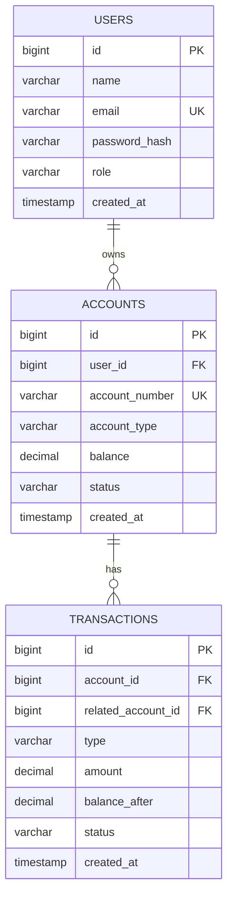

<!--
  BANKING APP — README TEMPLATE
  Drop this in as README.md on Day 1. Fill in [brackets] and check off features as you build them.
  Delete this comment block once you're done.
-->

# 🏦 [Your App Name] — Full-Stack Banking Application

> A full-stack banking platform with secure JWT authentication, account management, and transactional fund transfers — built with Spring Boot, PostgreSQL, and React.

[](.)
[](.)
[](.)
[](.)
[](.)

**🔗 Live Demo:** [add link once deployed]
**🔗 Backend API (Swagger):** [add link once deployed]
**🎥 Demo Video/GIF:** [optional — add once recorded]

---

## 📖 Table of Contents

- [Overview](#-overview)
- [Features](#-features)
- [Tech Stack](#-tech-stack)
- [Architecture](#-architecture)
- [Entity Relationship Diagram](#-entity-relationship-diagram)
- [Screenshots](#-screenshots)
- [Getting Started](#-getting-started)
- [API Documentation](#-api-documentation)
- [Project Structure](#-project-structure)
- [Key Engineering Decisions](#-key-engineering-decisions)
- [Roadmap / Future Improvements](#-roadmap--future-improvements)
- [Author](#-author)

---

## 🧭 Overview

[Write 3–4 sentences here once the project is done. Example:]

> [Your App Name] is a full-stack banking application that lets users register, open accounts, deposit/withdraw funds, and transfer money between accounts — with all balance-affecting operations wrapped in atomic, transactional database operations to guarantee data integrity. It features JWT-based authentication with role-based access control (Customer/Admin), a paginated transaction history, and an admin dashboard for account oversight. Built to demonstrate end-to-end full-stack ownership: schema design, secure REST API, and a responsive React frontend.

---

## ✅ Features

### Authentication & Authorization
- [ ] User registration (email + password, BCrypt hashing)
- [ ] JWT-based login
- [ ] Role-based access control (`CUSTOMER`, `ADMIN`)
- [ ] Protected routes (frontend) / secured endpoints (backend)

### Account Management
- [ ] Create bank account (Savings / Current)
- [ ] View account(s) and balance
- [ ] Freeze / unfreeze account (Admin)

### Transactions
- [ ] Deposit funds
- [ ] Withdraw funds (with balance validation)
- [ ] Transfer funds between accounts (atomic, `@Transactional`)
- [ ] Transaction history with pagination
- [ ] Filter transactions by type/date range

### Admin
- [ ] View all users and accounts
- [ ] View system-wide transaction logs

### Engineering / Quality
- [ ] DTOs (no entity exposed directly via API)
- [ ] Global exception handling (`@ControllerAdvice`)
- [ ] Input validation (`@Valid`, custom validators)
- [ ] Swagger / OpenAPI documentation
- [ ] Pagination & sorting on list endpoints
- [ ] Dockerized backend (optional)
- [ ] Deployed (backend + DB + frontend)

---

## 🛠 Tech Stack

**Backend**
- Java 21
- Spring Boot 3.x (Web, Security, Data JPA, Validation)
- PostgreSQL
- JWT (`jjwt` / Spring Security OAuth2 Resource Server)
- Lombok
- Swagger / springdoc-openapi

**Frontend**
- React 18 (Vite)
- React Router
- Axios
- Tailwind CSS
- Context API (auth state)

**DevOps / Tooling**
- Git & GitHub
- Postman (API testing/collection)
- Render / Railway (backend + PostgreSQL hosting)
- Vercel (frontend hosting)

---

## 🏗 Architecture

```
┌─────────────────┐        HTTPS/JSON        ┌──────────────────────┐        JDBC        ┌──────────────┐
│  React Frontend │ ───────────────────────▶ │  Spring Boot Backend │ ─────────────────▶ │  PostgreSQL  │
│  (Vercel)       │ ◀─────────────────────── │  (Render / Railway)  │ ◀───────────────── │  Database    │
└─────────────────┘      JWT in headers       └──────────────────────┘                     └──────────────┘
```

**Backend layers:** `Controller → Service → Repository → Entity`
DTOs mediate between Controller and Service; entities never leave the service layer.

---

## 🗺 Entity Relationship Diagram

> Rendered automatically on GitHub (Mermaid). Update field names as your schema evolves.



*(If your ER diagram tool doesn't render Mermaid, export a PNG from draw.io / dbdiagram.io and place it at `docs/erd.png`, then embed it below instead: ``)*

---

## 📸 Screenshots

> Add screenshots as you build each screen. Store images in a `docs/screenshots/` folder and reference them below.

| Login | Dashboard |
|---|---|
|  |  |

| Accounts | Transfer Funds |
|---|---|
|  |  |

| Transaction History | Admin Panel |
|---|---|
|  |  |

---

## 🚀 Getting Started

### Prerequisites
- Java 21+
- Node.js 18+
- PostgreSQL 14+
- Maven (or use the included `mvnw` wrapper)

### 1. Clone the repo
```bash
git clone https://github.com/[your-username]/[repo-name].git
cd [repo-name]
```

### 2. Database setup
```sql
CREATE DATABASE banking_app;
```

### 3. Backend setup
```bash
cd backend
# configure src/main/resources/application.properties (see application.properties.example)
./mvnw spring-boot:run
```
Backend runs at `http://localhost:8080`

**`application.properties.example`**
```properties
spring.datasource.url=jdbc:postgresql://localhost:5432/banking_app
spring.datasource.username=[your_pg_username]
spring.datasource.password=[your_pg_password]
spring.jpa.hibernate.ddl-auto=update
jwt.secret=[your_jwt_secret]
jwt.expiration=[e.g. 86400000]
```

### 4. Frontend setup
```bash
cd frontend
npm install
# configure .env — see .env.example
npm run dev
```
Frontend runs at `http://localhost:5173`

**`.env.example`**
```
VITE_API_BASE_URL=http://localhost:8080/api
```

---

## 📚 API Documentation

Once running locally, full interactive API docs are available at:
```
http://localhost:8080/swagger-ui.html
```

### Key Endpoints (fill in / update as you build)

| Method | Endpoint | Description | Auth Required |
|---|---|---|---|
| POST | `/api/auth/register` | Register a new user | No |
| POST | `/api/auth/login` | Login, returns JWT | No |
| GET | `/api/accounts` | List current user's accounts | Yes |
| POST | `/api/accounts` | Create a new account | Yes |
| POST | `/api/transactions/deposit` | Deposit funds | Yes |
| POST | `/api/transactions/withdraw` | Withdraw funds | Yes |
| POST | `/api/transactions/transfer` | Transfer funds between accounts | Yes |
| GET | `/api/transactions?page=&size=` | Paginated transaction history | Yes |
| GET | `/api/admin/users` | List all users (Admin only) | Yes (Admin) |

*A full Postman collection is available at `docs/postman_collection.json`.*

---

## 📁 Project Structure

```
banking-app/
├── backend/
│   ├── src/main/java/com/[yourpackage]/banking/
│   │   ├── controller/
│   │   ├── service/
│   │   ├── repository/
│   │   ├── entity/
│   │   ├── dto/
│   │   ├── exception/
│   │   ├── security/
│   │   └── config/
│   └── src/main/resources/
├── frontend/
│   ├── src/
│   │   ├── components/
│   │   ├── pages/
│   │   ├── context/
│   │   ├── services/    # Axios API calls
│   │   └── routes/
│   └── public/
└── docs/
    ├── erd.png
    ├── postman_collection.json
    └── screenshots/
```

---

## 🧠 Key Engineering Decisions

> Fill this section in as you build — these are exactly the points to bring up in interviews.

- **Atomic fund transfers:** [explain how you used `@Transactional` and how you prevented partial updates / race conditions on balance changes]
- **Security:** [explain JWT flow, password hashing, and any trade-offs — e.g., token storage strategy]
- **DTO layer:** [why you never expose entities directly]
- **Error handling:** [how `@ControllerAdvice` centralizes exception responses]
- **[Add more as you go]**

---

## 🔭 Roadmap / Future Improvements

- [ ] Refresh tokens
- [ ] Rate limiting on auth endpoints
- [ ] Email notifications for transactions
- [ ] Docker Compose for one-command local setup
- [ ] Unit + integration tests (JUnit, Mockito, Testcontainers)
- [ ] CI/CD pipeline (GitHub Actions)

---

## 👤 Author

**[Your Name]**
[LinkedIn] · [GitHub] · [Portfolio/Email]

---

<sub>Built as part of a self-directed full-stack learning project (2026).</sub>
